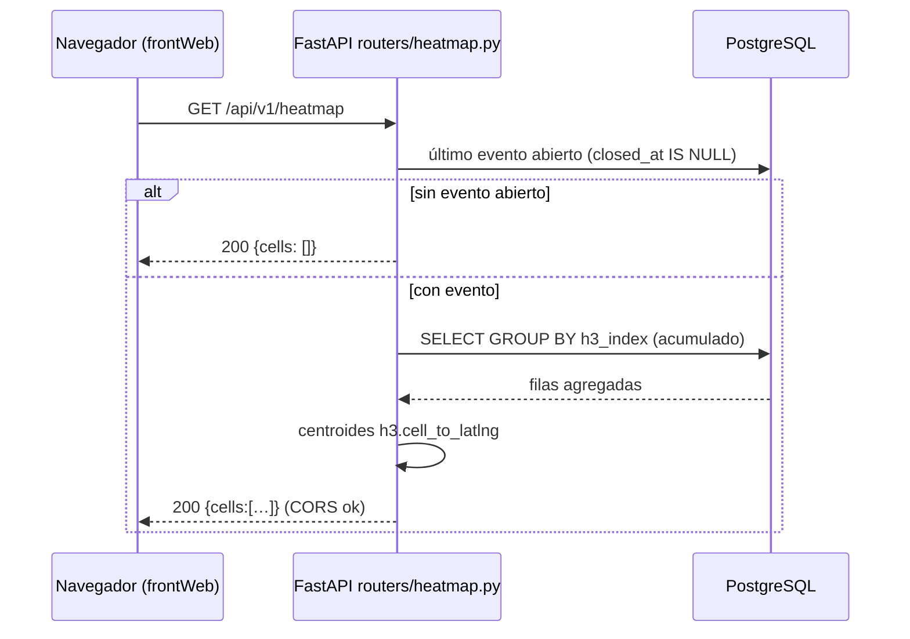
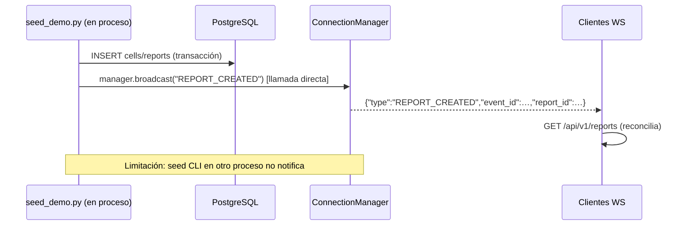
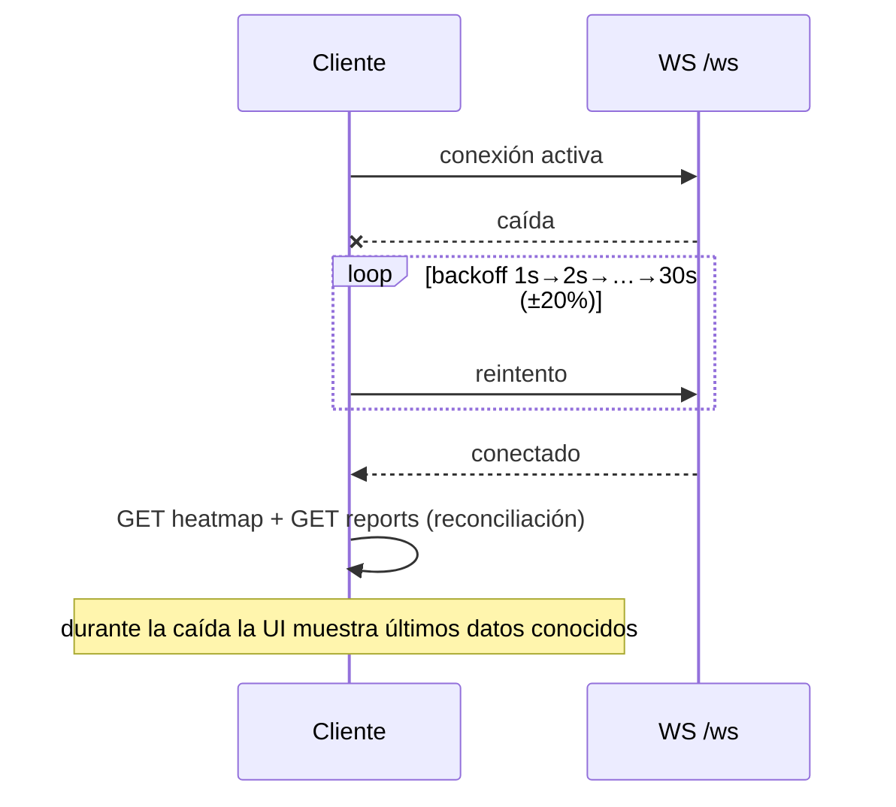

# Design: Dashboard web público Replica

## Enfoque técnico

Un solo proceso FastAPI (`backend/app/main.py`, arquitectura.md Componente 2) expone la superficie pública de solo lectura (`public-api-readonly`): dos GET + un WS de broadcast anónimo. El frontend vive en el directorio separado **`frontWeb/`** (Vite + React + TS, sitio estático) y consume exclusivamente esos endpoints. El seed (`backend/scripts/seed_demo.py`) es la única vía de datos (`demo-seed-data`). Todo cálculo es server-side; la UI solo renderiza (`dashboard-web-ui`). No se crean módulos extra: solo lo que `frontWeb/` consume.

## Decisiones de arquitectura

### D1 — Resolución H3 fijada en res 8 (~500 m)

| Opción | Tradeoff | Decisión |
|---|---|---|
| res 8 (~500 m) | Granularidad suficiente para heatmap urbano; respeta privacidad (celda >> posición individual) | ✅ |
| res 9 (~170 m) | Más detalle, mayor riesgo de reidentificación | ❌ |

Constante duplicada con nombre explícito: `H3_CELL_RESOLUTION = 8` en `backend/app/constants.py` y `H3_CELL_RESOLUTION = 8` en `frontWeb/src/lib/constants.ts`. **Fuente única de documentación**: esta decisión registrada en `openspec/DECISIONS.md`; ambos archivos citan ese registro en comentario. El agregador futuro debe importar la constante Python, nunca hardcodear.

### D2 — Schema de `reports.content`: contrato documentado + tipo TS espejo

Pragmático para hackathon: **schema JSON v1 definido en este documento** (y construido solo por el seed), sin validación runtime en ninguno de los dos lados:

```json
{ "version": 1, "title": "...", "summary": "...", "recommendations": ["..."], "figures": {"cells_active": 0, "people_helped": 0} }
```

Backend lo pasa tal cual (spec: DEBE NO interpretarlo). Frontend define `interface ReportContent` espejo en `frontWeb/src/lib/types.ts` y renderiza defensivamente (campos ausentes ≠ crash). Alternativa rechazada: pydantic + zod doble validación (costo alto, beneficio nulo sin pipeline LLM real).

### D3 — Seed idempotente por reconstrucción con `DEMO_EVENT_ID` fijo

Elección: upsert por `event_id` constante `"DEMO-EARTHQUAKE001"`. Si el evento existe, el script borra sus `received_cells` y `reports` (FK CASCADE cubre celdas; DELETE explícito para reports, que es RESTRICT) y reinserta datos frescos en una transacción. Re-ejecutar ⇒ mismo conjunto lógico, cero duplicados.

- Alternativas: flag `--reset` (dos modos de operación = más superficie de error en demo) vs upsert fila a fila (deja basura si cambia la distribución sembrada).
- Racional: un solo comando determinista; el "reset" implícito por evento acota el borrado al evento demo (nunca toca otros eventos).

### D4 — Backoff de reconexión WS: parámetros exactos

Inicial **1000 ms**, factor **×2**, máximo **30 000 ms**, jitter aleatorio ±20 % sobre cada intento. Reconexión exitosa ⇒ reinicia a 1000 ms. Al abrirse la conexión (primera vez o tras caída) se dispara reconciliación REST completa (heatmap + reports). Implementado en `frontWeb/src/hooks/useWebSocket.ts`; estos valores son verificables en verify.

### D5 — Estructura FastAPI

```
backend/app/
├── main.py                  # create_app(): lifespan (Base.metadata.create_all), CORS, routers
├── constants.py             # H3_CELL_RESOLUTION = 8
├── routers/{__init__,heatmap,reports,ws}.py
├── schemas/dashboard.py     # CellOut, HeatmapResponse, ReportOut, ReportsResponse, ErrorResponse
└── ws.py                    # ConnectionManager (singleton in-process)
```

- Config: `Settings` (dataclass existente) gana campo `cors_origins: list[str]` desde env `BACKEND_CORS_ORIGINS` (coma-separada). Sin wildcard con credenciales.
- Sesiones vía dependencia `get_session()` existente. Sincronía (motor sync psycopg ya existe); broadcast usa `asyncio`.

### D6 — Query del heatmap: GROUP BY celda sobre ventana acumulada

Último evento abierto: `SELECT … WHERE closed_at IS NULL ORDER BY occurred_at DESC LIMIT 1`. Sin evento ⇒ respuesta vacía 200; `event_id` dado e inexistente ⇒ 404 tipado. Celdas acumuladas (una fila por `h3_index`, porque `received_cells` tiene una fila por ventana y `H3HexagonLayer` necesita un polígono por celda):

```sql
SELECT h3_index,
       SUM(telegram_count)          AS telegram_count,
       MAX(intensity)               AS intensity,
       MAX(window_start)            AS window_start
FROM received_cells
WHERE event_id = :eid
GROUP BY h3_index
```

Ambos agregados son selecciones sobre valores ya precalculados — **no se recalcula intensidad** (MAX = más severa de sus ventanas, conservador). Centroide derivado en serialización con `h3.cell_to_latlng(h3_index)` (h3-py), punto único de verdad server-side.

### D7 — Broadcast WS: manager en proceso + límite monoproceso documentado

`ConnectionManager` mantiene el set de sockets activos (acepta cualquiera; origen validado contra `cors_origins`). Mensajes tipados `CELLS_UPDATED`/`REPORT_CREATED`, sin estado. La notificación desde código del mismo proceso es llamada directa `manager.broadcast(...)` — cumple la regla sin-HTTP-interna. **Limitación documentada**: `seed_demo.py` como CLI corre en otro proceso y NO puede llamar al manager; en el flujo de demo (seed → arrancar servidor) los clientes cargan estado por GET al conectar. Si el seed corre embebido en el proceso del servidor (import directo), sí notifica. No hay pub/sub externo (Redis) — fuera de presupuesto.

### D8 — Scaffold `frontWeb/`

Vite `react-ts`. Estructura:

```
frontWeb/src/
├── main.tsx / App.tsx        # shell liviano; mapa bajo React.lazy
├── api/client.ts             # base URL = env VITE_API_URL; fetch heatmap/reports
├── hooks/useWebSocket.ts     # backoff D4 + reconciliación
├── map/MapCanvas.tsx         # chunk diferido: MapLibre GL + deck.gl H3HexagonLayer
├── components/{ReportFeed,StatusBanner}.tsx
└── lib/{constants.ts,types.ts}
```

- `H3HexagonLayer` consume `h3_index` directo (sin re-binning); rampa de color por `intensity`.
- Basemap: estilo OpenFreeMap `https://tiles.openfreemap.org/styles/liberty` (sin API key).
- Lazy-load: `React.lazy(() => import("./map/MapCanvas"))` con Suspense — deck.gl+MapLibre quedan en chunk aparte.
- Estados vacío/carga/error explícitos (specs UI).

## Flujo de datos y diagramas

### Solicitud heatmap



### Actualización realtime (seed embebido)



### Reconexión WS con reconciliación



## Archivos afectados

| Archivo | Acción | Descripción |
|---|---|---|
| `backend/app/main.py` | Crear | App única, lifespan, CORS |
| `backend/app/constants.py` | Crear | `H3_CELL_RESOLUTION = 8` |
| `backend/app/routers/{heatmap,reports,ws}.py` (+`__init__.py`) | Crear | Endpoints públicos |
| `backend/app/schemas/dashboard.py` | Crear | Modelos pydantic de respuesta |
| `backend/app/ws.py` | Crear | `ConnectionManager` |
| `backend/app/config.py` | Modificar | `cors_origins` desde env |
| `backend/scripts/seed_demo.py` | Crear | Seed idempotente (D3) |
| `backend/pyproject.toml` | Modificar | fastapi, uvicorn[standard], h3 |
| `frontWeb/**` | Crear | Scaffold completo (D8) |
| `openspec/DECISIONS.md` | Modificar | Registrar decisiones (hecho en esta fase) |

## Interfaces / contratos

Ver specs (`public-api-readonly`) para los cuerpos completos. Errores tipados: `{"detail": {"code": "EVENT_NOT_FOUND", "message": "…"}}` con 404. WS: desconexión limpia ante socket muerto (try/finally en handler).

## Estrategia de testing

Sin framework de tests (config.yaml: `tdd: false`). Verificación manual/smoke documentada en verify: seed en DB limpia → curl de ambos GET (incluidos casos 404/vacío) → cliente WS (wscat) recibe broadcasts del seed embebido → navegador: estados vacío/carga/error y reconexión (matar uvicorn y relanzar).

## Matriz de amenazas

N/A — sin routing custom, shell, subprocesses, automatización VCS/PR, clasificación de ejecutables ni integración de procesos. Superficie 100 % lectura HTTP/WS con CORS explícito (cubierto por spec de privacidad/CORS).

## Migración / rollout

Change 100 % aditivo: no modifica modelos existentes. `create_all` en lifespan crea tablas si faltan (idempotente). Rollback: revertir commits y borrar `frontWeb/`; datos demo eliminables con `DELETE` por `DEMO_EVENT_ID`.

## Preguntas abiertas

- Ninguna bloqueante. Pendiente menor: URL final del deploy (Railway/Vercel) para llenar `BACKEND_CORS_ORIGINS`/`VITE_API_URL` productivos.
